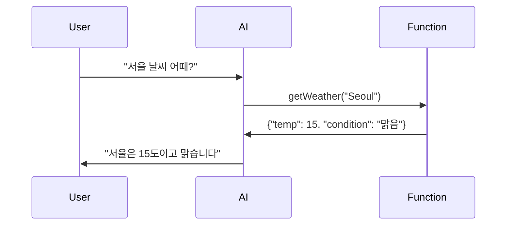

# 26. Function Calling (Tool Calling)

## 📖 학습 목표

- **Function Calling**의 개념과 활용법을 이해합니다
- **@Tool** 어노테이션으로 함수를 정의합니다
- **외부 API 연동**으로 실시간 정보를 제공합니다
- **다중 함수 호출**로 복잡한 작업을 수행합니다

---

## 🔑 핵심 키워드

1. **Function Calling** - AI가 외부 함수를 호출
2. **@Tool** - 함수를 AI에게 제공
3. **Weather API** - 실시간 날씨 정보
4. **Database Query** - 데이터베이스 조회
5. **Multiple Functions** - 여러 함수 동시 제공

---

## 1. Function Calling이란?

**Function Calling**은 AI가 필요한 정보를 얻기 위해 외부 함수를 호출하는 기능입니다.

### 예시
```kotlin
User: "서울 날씨 어때?"
AI: [getWeather("Seoul") 호출]
Function: {"temp": 15, "condition": "맑음"}
AI: "서울은 현재 15도이고 맑습니다"
```

---

## 2. 샘플 구성

### Sample 01: Basic Function Calling
- @Tool 어노테이션 사용
- 간단한 함수 정의
- **포트:** 9600

### Sample 02: Weather Function
- 실시간 날씨 API 연동
- 외부 데이터 조회
- **포트:** 9601

### Sample 03: Multiple Functions
- 여러 함수 동시 제공
- AI가 적절한 함수 선택
- **포트:** 9602

### Sample 04: Database Query Function
- 데이터베이스 조회
- 복잡한 인자 처리
- **포트:** 9603

---

## 3. @Tool 어노테이션

```kotlin
@Configuration
class ToolConfig {
    
    @Bean
    @Tool(
        name = "getCurrentWeather",
        description = "Get the current weather for a location"
    )
    fun weatherFunction(): (WeatherRequest) -> WeatherResponse {
        return { request ->
            // 날씨 정보 조회
            WeatherResponse(
                location = request.location,
                temperature = 15,
                condition = "Sunny"
            )
        }
    }
}
```

---

## 4. Function Calling 흐름



---

## 5. 공통 설정

```yaml
spring:
  ai:
    openai:
      api-key: ${OPENAI_API_KEY}
      chat:
        options:
          model: gpt-4o-mini
```

---

**시작하기**: [Sample 01: Basic Function Calling](./sample01-basic-function/)
