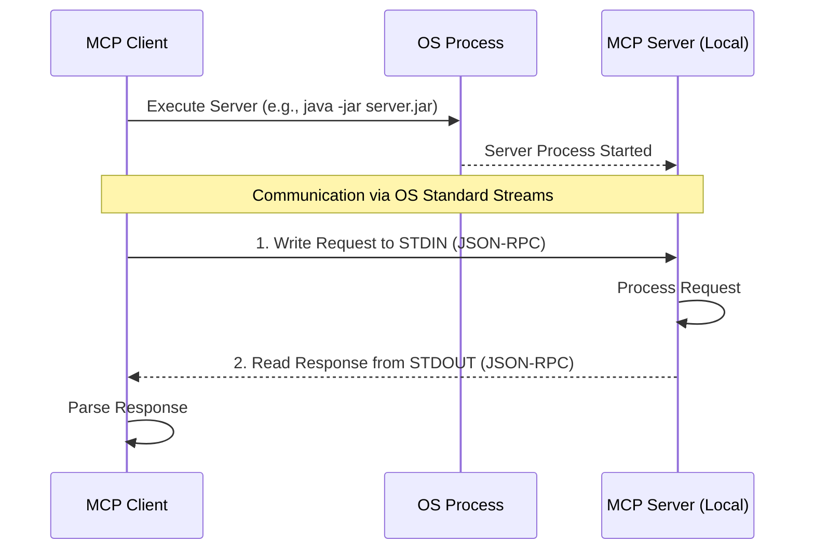
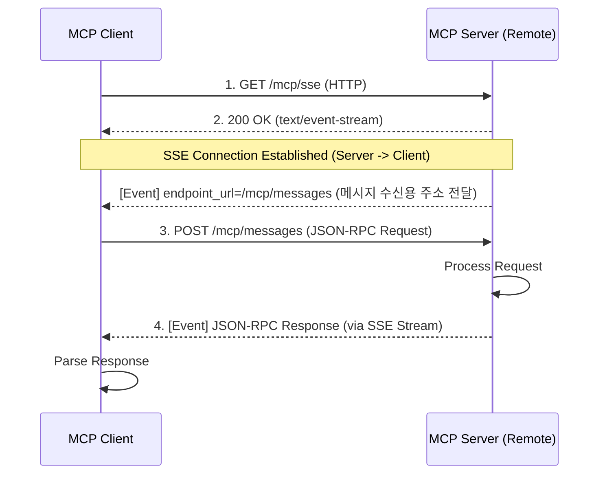

# 27. MCP Client (Model Context Protocol)

## 📖 학습 목표

- **MCP (Model Context Protocol)**의 개념을 이해합니다
- **MCP Client**로 외부 서비스와 연동합니다
- **MCP Resources**와 **Tools**를 활용합니다
- **다양한 Transport** 방식을 학습합니다

---

## 🔑 핵심 키워드

1. **MCP** - Model Context Protocol
2. **MCP Client** - 외부 서비스 연동 클라이언트
3. **Resources** - 외부 데이터 소스
4. **Tools** - MCP를 통한 함수 호출
5. **Transport** - STDIO, HTTP, SSE

---

## 1. MCP란?

**MCP (Model Context Protocol)**는 AI 모델이 외부 서비스와 표준화된 방식으로 통신하는 프로토콜입니다.

### 주요 기능
- **Resources**: 외부 데이터 읽기
- **Tools**: 외부 함수 호출
- **Prompts**: 템플릿 관리

---

## 2. 샘플 구성

### Sample 01: Basic MCP Client
- MCP Client 기본 설정
- STDIO Transport
- **포트:** 9700

### Sample 02: MCP Resources
- 외부 리소스 조회
- Resource 읽기
- **포트:** 9701

### Sample 03: MCP Tools Integration
- MCP Tools 활용
- ChatClient 통합
- **포트:** 9702

---

## 3. MCP 구성 요소

```yaml
spring:
  ai:
    mcp:
      client:
        my-server:
          transport:
            stdio:
              command: "node"
              args: ["server.js"]
```

---

## 4. Transport 방식

MCP Client는 MCP Server와 통신하기 위해 주로 **STDIO**와 **SSE(Server-Sent Events)** 방식을 사용합니다. 

### 4.1 STDIO (Standard Input/Output) 방식
STDIO 방식은 클라이언트 애플리케이션이 MCP Server 애플리케이션(예: `.jar` 파일)을 **자식 프로세스(Sub-process)** 로 직접 실행하고, 운영체제의 표준 입출력 스트림(`stdin`, `stdout`)을 통해 JSON-RPC 메시지를 주고받는 방식입니다. 네트워크 포트를 사용하지 않으므로 로컬 환경에서 가장 빠르고 안전하게 동작합니다.


- **장점**: 설정이 매우 단순함. 네트워크 방화벽 문제 없음.
- **적용**: 로컬 PC 환경, 단일 인스턴스 앱 내장 기능

### 4.2 SSE (Server-Sent Events) 방식
SSE 방식은 서버가 HTTP를 통해 지속적인 이벤트 스트림 단방향 채널(Server -> Client)을 열어 두고, 클라이언트는 별도의 HTTP 엔드포인트(Post)를 통해 요청을 보내는 구조입니다. 이 두 방식의 결합으로 서버는 클라이언트 측에 비동기/실시간으로 응답(이벤트)을 내려보낼 수 있게 됩니다. 원격 서버 연동 시 표준으로 사용됩니다.


- **장점**: 원격 네트워크 연동 가능. 점진적인 응답 처리에 유리(Streaming).
- **적용**: 외부 API 서버, 독립적인 분산 아키텍처 환경

---

## 5. 공통 설정

```yaml
spring:
  ai:
    openai:
      api-key: ${OPENAI_API_KEY}
    mcp:
      client:
        enabled: true
```

---

**시작하기**: [Sample 01: Basic MCP Client](./sample01-basic-mcp/)
