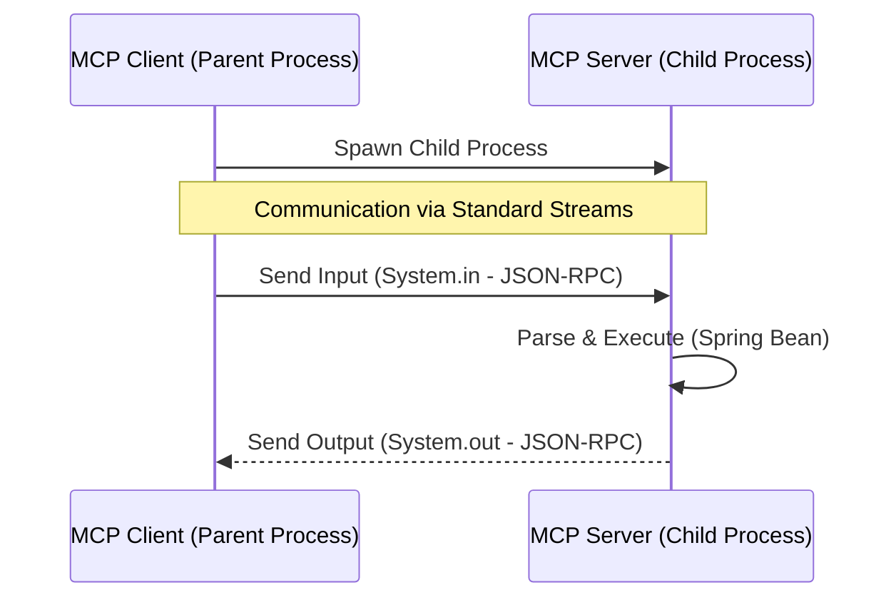
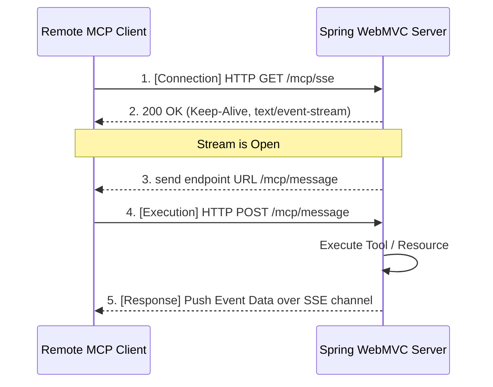

# 28. MCP Server (Model Context Protocol Server)

## 📖 학습 목표

- **MCP Server**를 구축하고 제공합니다
- **@McpResource**로 데이터 소스를 노출합니다
- **@McpTool**로 함수를 제공합니다
- **@McpPrompt**로 템플릿을 관리합니다

---

## 🔑 핵심 키워드

1. **MCP Server** - AI 모델에게 서비스 제공
2. **@McpResource** - 데이터 소스 노출
3. **@McpTool** - 함수 제공
4. **@McpPrompt** - 프롬프트 템플릿
5. **STDIO/WebMVC** - Transport 방식

---

## 1. MCP Server란?

**MCP Server**는 AI 모델이 사용할 수 있는 Resources, Tools, Prompts를 제공하는 서버입니다.

### 제공 기능
- **Resources**: 파일, DB 등 데이터 소스
- **Tools**: 실행 가능한 함수
- **Prompts**: 재사용 가능한 템플릿

---

## 2. 샘플 구성

### Sample 01: Basic MCP Server
- MCP Server 기본 설정
- STDIO Transport
- **포트:** 9800

### Sample 02: MCP Resources Provider
- @McpResource 어노테이션
- 데이터 소스 제공
- **포트:** 9801

### Sample 03: MCP Tools Provider
- @McpTool 어노테이션
- 함수 제공
- **포트:** 9802

### Sample 04: MCP Prompts Provider
- @McpPrompt 어노테이션
- 템플릿 관리
- **포트:** 9803

---

## 3. MCP Server 어노테이션

```kotlin
@McpResource(
    uri = "file://data.txt",
    name = "Data File",
    description = "Sample data file"
)
fun getDataResource(): String {
    return "Sample data content"
}

@McpTool(
    name = "calculate",
    description = "Perform calculation"
)
fun calculate(a: Int, b: Int): Int {
    return a + b
}

@McpPrompt(
    name = "greeting",
    description = "Greeting template"
)
fun greetingPrompt(name: String): String {
    return "Hello, $name!"
}
```

---

## 4. Transport 방식

MCP Server는 클라이언트로부터의 연결을 처리하기 위해 다양한 전송(Transport) 계층을 지원합니다. 대표적으로 **STDIO** 방식과 **SSE(WebMVC)** 방식이 쓰입니다.

### 4.1 STDIO (Standard Input/Output) 방식
STDIO는 로컬 PC 내의 프로세스 간 통신(IPC) 기법입니다. 클라이언트가 이 서버를 커맨드라인에서 서브 프로세스로 구동시킵니다. 서버 애플리케이션은 시스템의 콘솔 표준 입력(`System.in`)으로 명령을 읽고 표준 출력(`System.out`)으로 결과를 내뱉는 단순한 구조로 작동하게 됩니다.


- **장점**: 포트 번호 충돌이나 네트워크 셋업 불필요
- **제약**: 클라이언트와 서버가 물리적으로 동일한 머신(컨테이너) 안에서 구동되어야 함

### 4.2 SSE (Server-Sent Events) 기반 HTTP 방식
HTTP/SSE 기반 서버는 외부에 특정 포트(예: 8080)를 열고 응답 대기합니다. 서버는 `text/event-stream` 형태의 SSE 연결 파이프프라인을 클라이언트 쪽에 유지시키면서 응답 데이터나 비동기 이벤트를 밀어줍니다. 요청은 별도의 POST 엔드포인트를 통해 비동기적으로 들어오게 됩니다.


- **장점**: 인터넷 상의 다양한 언어, 다양한 플랫폼 환경의 클라이언트를 서비스 플랫폼으로 서빙 가능
- **특징**: `WebFlux` 혹은 `WebMVC Reactive` 스트림 기반으로 동작하여 비동기성에 매우 강함

---

## 5. 공통 설정

```yaml
spring:
  ai:
    mcp:
      server:
        enabled: true
        name: "My MCP Server"
        version: "1.1.2"
```

---

**시작하기**: [Sample 01: Basic MCP Server](./sample01-basic-server/)
